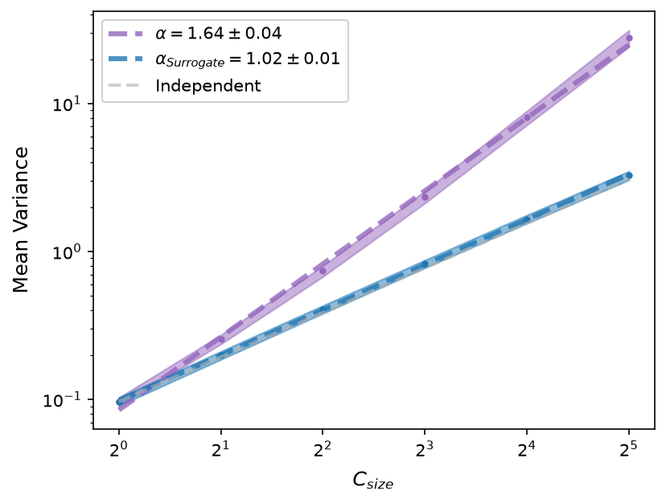
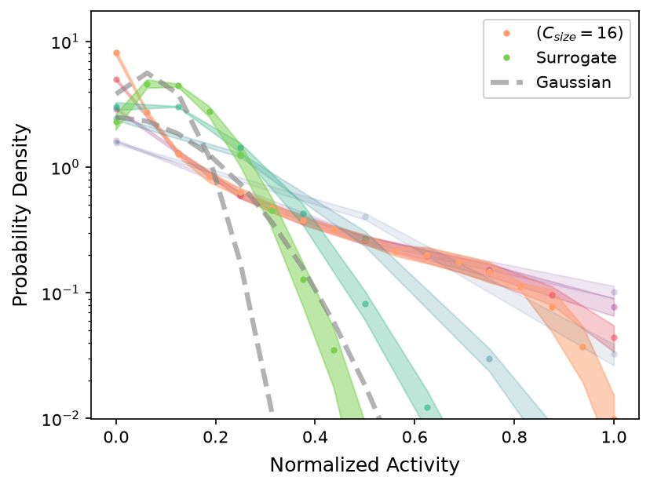
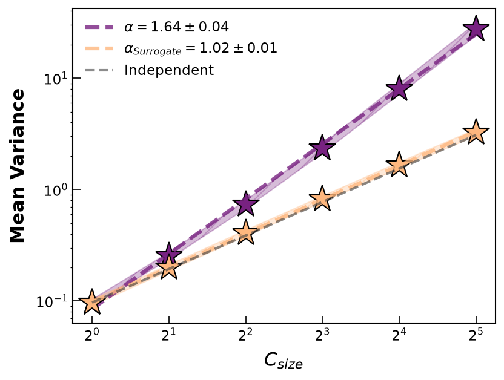
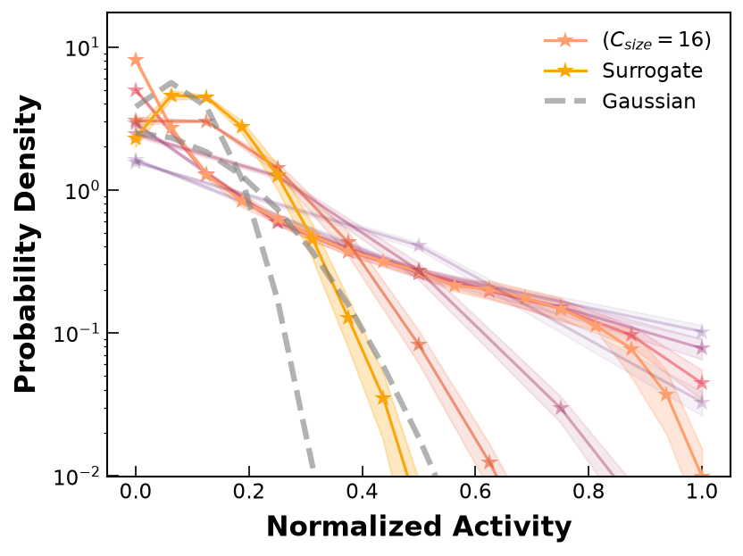

# Styling your plots

The plotting functions in `prg_toolbox.plot` work out of the box with sensible
defaults, but every visual detail -- colors, markers, fills, fonts, legend
placement -- can be overridden. This page walks through both, using real
example data so the difference is easy to see.

## Two families of plots

The plotting functions split into two families, and each is colored
differently:

* **Single-curve plots** -- `plot_mean_variance`, `plot_log_silence_probability`,
  `plot_max_covariance_eigenvalue`, `plot_decay_time` -- draw one line per
  dataset (data / surrogate / a trivial reference line), so they take a
  **`colors`** argument: a dict with up to three keys, `'data'`, `'surrogate'`,
  and `'reference'`.
* **Function-valued plots** -- `plot_covariance_spectrum`,
  `plot_autocorrelation_function`, `plot_activity_distribution` -- draw one
  curve *per coarse-graining step*, so a single color isn't enough. They take
  a **`palette`** argument instead: a colormap name (or dict with `'data'`
  and `'surrogate'` keys) that colors successive curves along a gradient.

Both arguments accept the same three shorthands:

```python
colors = None                                  # all defaults
colors = "seagreen"                            # only 'data' changes
colors = {"reference": "black"}                # only 'reference' changes, rest stay default
colors = {"data": "green", "surrogate": "grey"} # any subset of keys

palette = None                                 # all defaults
palette = "plasma"                             # only 'data' colormap changes
palette = {"surrogate": "cool"}                # only 'surrogate' colormap changes
```

You don't need to know about `'surrogate'` or `'reference'` just to recolor
your own data -- a plain string is enough.

## The data used below

The examples below use 3 independent random 64-unit subsamples of a real V4
cortex spike recording bundled as example data, averaged via `run_PRG`'s
`nsamples` so the resulting observables carry a genuine spread across
samples (that's what `fill_kwargs` renders), alongside the same pipeline run
on an ISI-shuffled surrogate (a null model that destroys temporal
correlations while preserving each unit's firing rate):

```python
import prg_toolbox as prg
from prg_toolbox.analysis_tools import pick_random_sample, shuffle_isi

path = prg.datasets.get_spike_data(files=["V4-5E"])

params = prg.config.AnalysisParams()
params.loading.data_format = "tabular"
params.rg_steps = 5
params.cluster_method = "pearson"
params.subsampling.samplesize = 64
params.subsampling.nsamples = 3
params.observables = [prg.mean_variance, prg.activity_distribution]

timestamps = prg.tools.load_data(path, user_params=params)
surrogate_timestamps = shuffle_isi(timestamps, data_format="tabular", random_seed=7)

data_result = prg.run_PRG(timestamps, user_params=params)
surrogate_result = prg.run_PRG(surrogate_timestamps, user_params=params)

mv_data, mv_surr = data_result["mean_variance"], surrogate_result["mean_variance"]
ad_data, ad_surr = data_result["activity_distribution"], surrogate_result["activity_distribution"]
```

!!! note
    `shuffle_isi` scans the data once per unit, so shuffling a recording
    with thousands of units can take minutes. The generation script behind
    this page (`docs/generate_plot_examples.py`) first narrows down to a
    500-unit pool with `pick_random_sample` -- still plenty for `run_PRG`'s
    3 samples to differ -- before shuffling, which keeps this fast. See the
    script for the full version.

The real data's mean-variance scaling (`α ≈ 1.64`) sits well above the
`α = 1` trivial/independent baseline, while its shuffled surrogate
(`α ≈ 1.02`) collapses right back onto it -- exactly the kind of contrast
these plots are meant to reveal.

## Default style

```python
import matplotlib.pyplot as plt

fig, ax = plt.subplots()
prg.plot.plot_mean_variance(mv_data, surrogate_data=mv_surr, ax=ax)
```



```python
fig, ax = plt.subplots()
prg.plot.plot_activity_distribution(ad_data, surrogate_data=ad_surr, ax=ax)
```



## Custom style

Both examples below lean on colors sampled from the `magma` colormap
(`#782281` for data, `#feb77e` for surrogate) to keep a consistent look, and
push a few kwargs hard on purpose -- star markers, exaggerated sizes, a hatch
fill, bold labels -- just to make the visual effect of each one obvious.

```python
prg.plot.plot_mean_variance(
    mv_data,
    surrogate_data=mv_surr,
    ax=ax,
    colors={"data": "#782281", "surrogate": "#feb77e", "reference": "#3f3f3f"},
    plot_kwargs={"marker": "*", "markersize": 22, "markeredgewidth": 1.0, "markeredgecolor": "black"},
    fill_kwargs={"alpha": 0.3, "hatch": "//"},
    label_kwargs={"fontsize": 15, "fontweight": "bold"},
    legend_kwargs={"fontsize": 11, "loc": "upper left", "frameon": False},
    tick_kwargs={"labelsize": 11, "direction": "in", "length": 6},
)
```



```python
prg.plot.plot_activity_distribution(
    ad_data,
    surrogate_data=ad_surr,
    ax=ax,
    palette={"data": "magma", "surrogate": "inferno"},
    plot_kwargs={"marker": "*", "markersize": 10, "linestyle": "-", "linewidth": 1.5},
    fill_kwargs={"alpha": 0.25},
    label_kwargs={"fontsize": 15, "fontweight": "bold"},
    legend_kwargs={"fontsize": 11, "loc": "upper right", "frameon": False},
    tick_kwargs={"labelsize": 11, "direction": "in", "length": 6},
)
```



!!! warning "One gotcha"
    `plot_kwargs` is shared by every line the function draws, including the
    dashed reference/Gaussian guide line -- not just your data. Setting
    `"linewidth": 0` there to suppress connecting lines between markers, for
    instance, would also zero out the reference line's width and make it
    (and its legend entry) disappear. The default `"linestyle": "None"`
    already prevents markers from being connected, so you rarely need
    `linewidth` at all for a markers-only look.

## Kwargs cheatsheet

| Argument | Forwarded to | Controls |
|---|---|---|
| `colors` / `palette` | line/colormap color | which color(s) 'data', 'surrogate', 'reference' use |
| `plot_kwargs` | `ax.plot` | marker, markersize, linewidth, linestyle, alpha, ... |
| `fill_kwargs` | `ax.fill_between` | the std.-error band: alpha, hatch, ... |
| `label_kwargs` | `ax.set_xlabel` / `ax.set_ylabel` | fontsize, fontweight, labelpad, ... |
| `legend_kwargs` | `ax.legend` | loc, frameon, fontsize, ncol, ... |
| `tick_kwargs` | `ax.tick_params` | labelsize, direction, length, ... |

Every one of these can also be set once via a shared `PlotStyleConfig` (or
the `plot_style` field of `AnalysisParams`) and passed as `style_config=...`,
instead of repeating them on every call -- see
[Configuration](reference_config.md). An explicit keyword argument always
wins over whatever the config object provides.

*(Figures on this page are static and generated by
`docs/generate_plot_examples.py` -- rerun it after changing the plotting API
to refresh them.)*
